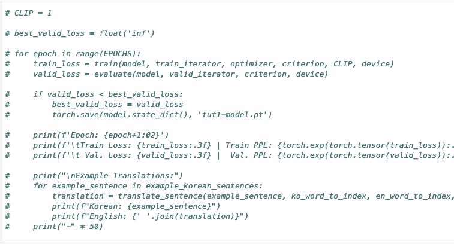
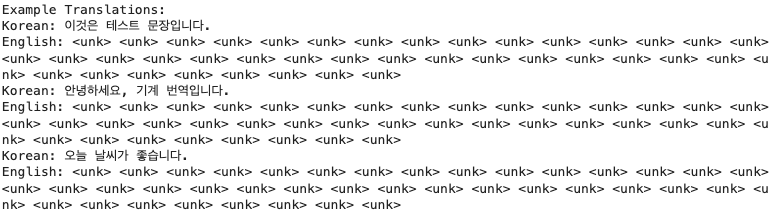
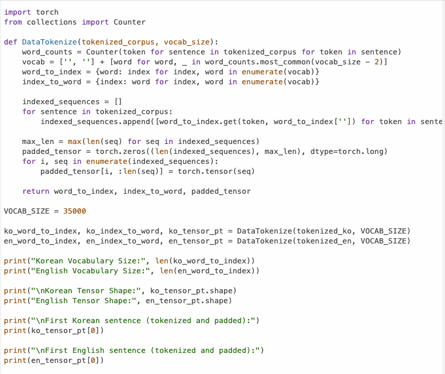
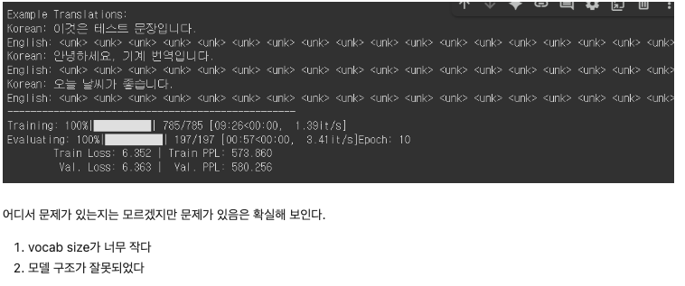
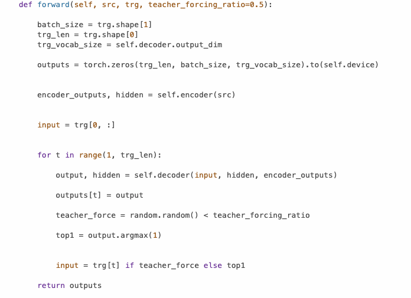
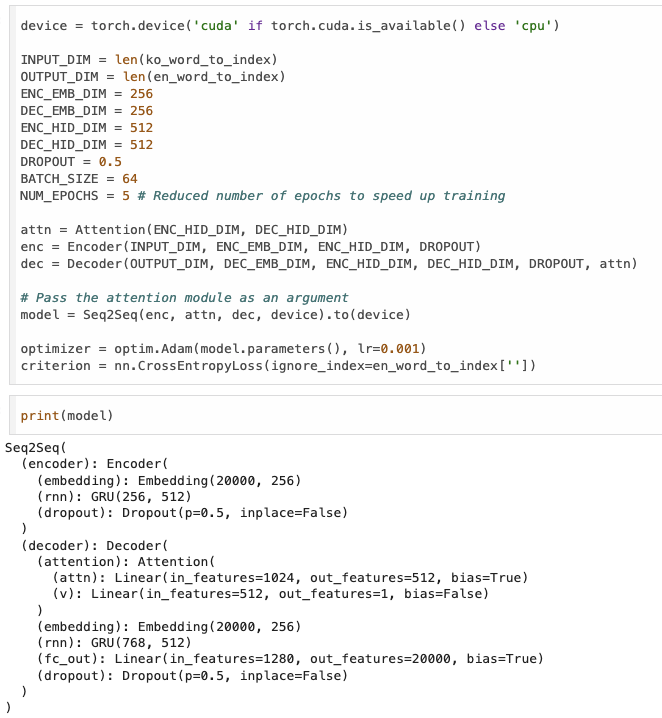

# AIFFEL Campus Online Code Peer Review Templete
- 코더 : 원균재
- 리뷰어 : 박진용

# PRT(Peer Review Template)
- [ ]  **1. 주어진 문제를 해결하는 완성된 코드가 제출되었나요?**
- 
    생성은 하였지만의미있어 보이는 출력이 아닌 <unk>의 반복만 출력되었다. 
  - 
  - 

- [ ]  **2. 전체 코드에서 가장 핵심적이거나 가장 복잡하고 이해하기 어려운 부분에 작성된 
주석 또는 doc string을 보고 해당 코드가 잘 이해되었나요?**
- 위 출력의 문제를 확인하고 차원문제임을 파악,
- 이를 해결하기 위해 차원사이즈를 조정하고 맞춰주는 코드인데
- 코드를 직접 확인하니 간단한 주석이 들어갔으면 좋았을것이라 생각함
  -   

- [x]  **3. 에러가 난 부분을 디버깅하여 문제를 해결한 기록을 남겼거나
새로운 시도 또는 추가 실험을 수행해봤나요?**
- 위의 잘못된 출력의 원인을 예측하고 이를 해결하기 위한 추가실험을 진행하였다.
  - vocab size를 조정하고 출력방식을 transformer에 적합한 호출방식에서 rnn기반의 seq2seq에 적합한 토큰단위 방식으로 변경하였다.
- -   
- -   
    - 문제 원인 및 해결 과정을 잘 기록하였는지 확인
    - 프로젝트 평가 기준에 더해 추가적으로 수행한 나만의 시도, 
    실험이 기록되어 있는지 확인
        - 중요! 잘 작성되었다고 생각되는 부분을 캡쳐해 근거로 첨부

- [ ]  **4. 회고를 잘 작성했나요?**
    아쉽게 작성되지 못했다 다음에 작성되면 좋을듯 싶다.

- [x]  **5. 코드가 간결하고 효율적인가요?**
-  필요한 함수들을 잘 모듈화 하여 모델 훈련 셀에서 간결한 코드로 실행 가능해졌다.
- 모델 출력을 통해 한눈에 보기 좋게 보여준것도 좋았다.
-   
    - 파이썬 스타일 가이드 (PEP8) 를 준수하였는지 확인
    - 코드 중복을 최소화하고 범용적으로 사용할 수 있도록 함수화/모듈화했는지 확인
        - 중요! 잘 작성되었다고 생각되는 부분을 캡쳐해 근거로 첨부

# 회고(참고 링크 및 코드 개선)
```
전반적으로 여러 시도를 해본게 느껴지는 코드였다.
최적의 vocab size를 찾기 위해 그리드 서치를 이용한것도 인상적이였고
문제 해결을 위한 논리적 탐색또안 좋았다.

아쉬운점을 시간에 쫒겨 만족할만한 결과를 보지 못했다는 점인데 
이렇게 조금씩 치이다보면 시간에 쫒기지 않고 다 완수 할 날이 곧 오지 않을까 싶다.

수고하셨습니다.
```
