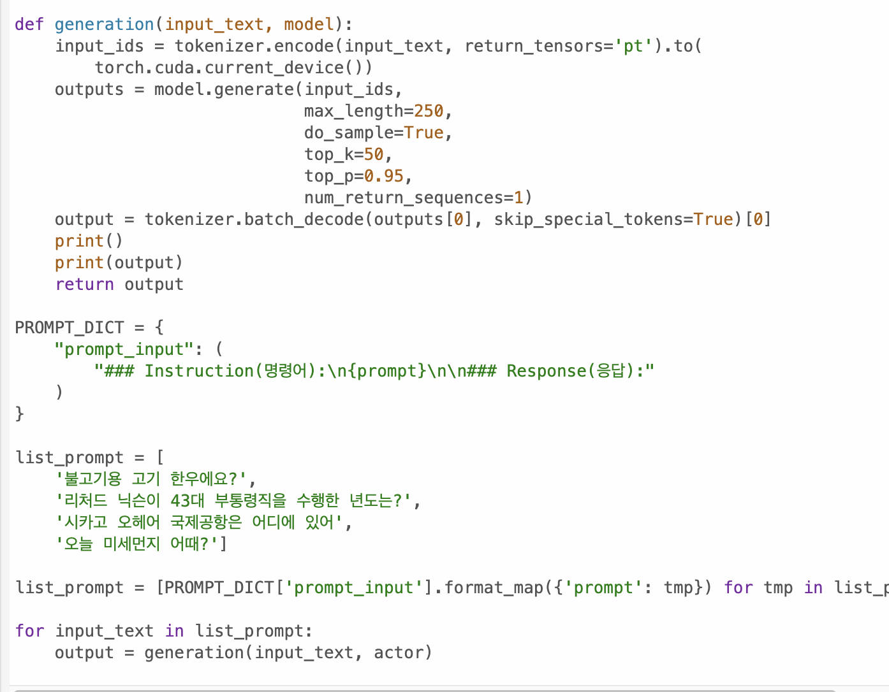
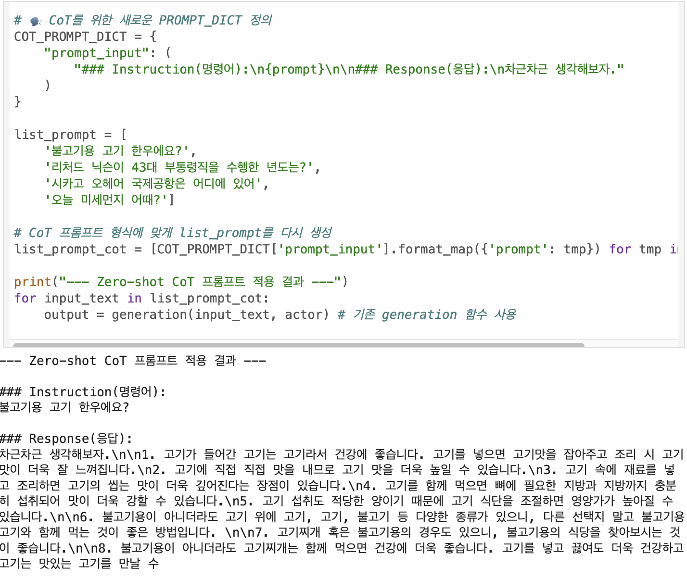
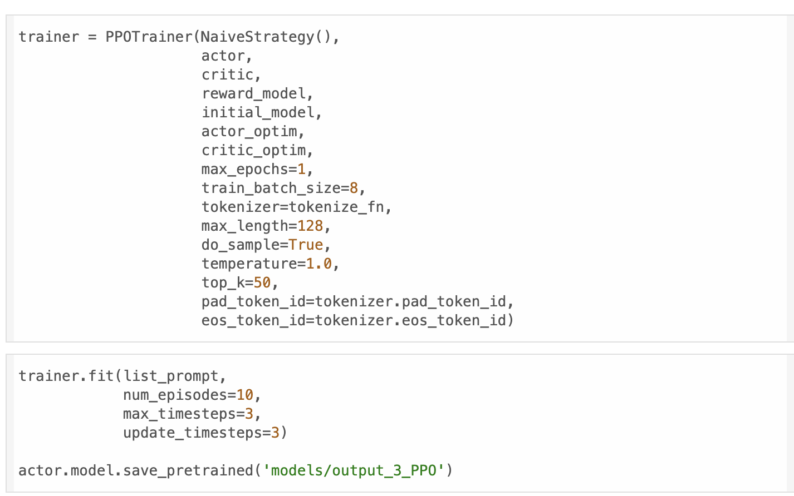
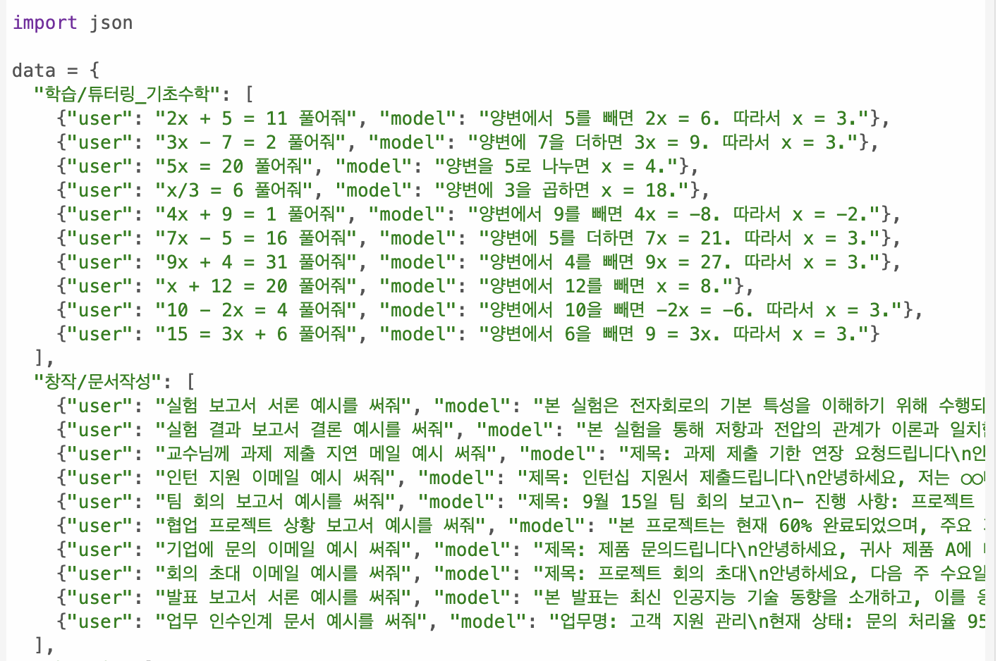
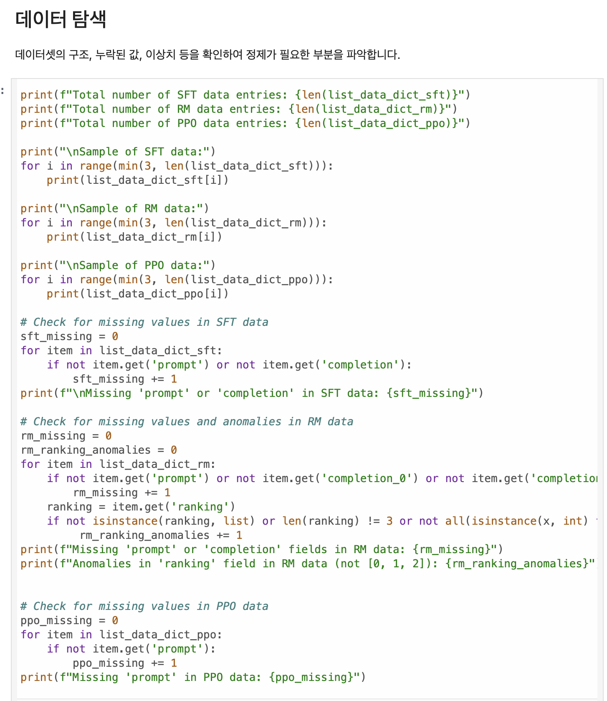

# AIFFEL Campus Online Code Peer Review Templete
- 코더 : 원균재
- 리뷰어 : 박진용

# PRT(Peer Review Template)
- [x]  **1. 주어진 문제를 해결하는 완성된 코드가 제출되었나요?**
    - 다양한 학습기법을 적용해 사람이 보기에 적절한 출력을 만들었다.
    - 
   - 
    - 문제에서 요구하는 최종 결과물이 첨부되었는지 확인
        - 중요! 해당 조건을 만족하는 부분을 캡쳐해 근거로 첨부

- [x]  **2. 전체 코드에서 가장 핵심적이거나 가장 복잡하고 이해하기 어려운 부분에 작성된 
주석 또는 doc string을 보고 해당 코드가 잘 이해되었나요?**
    - PPO를 수행하기 위해 베이스 모델부터 SFT, RM등 사전작업이 준수히 이루어져야하고
    - 이를 잘 수했했을 때 해당 코드의 의미가 있어지기 때문에 선정했다.
    - 
    - 
    - 해당 코드 블럭을 왜 핵심적이라고 생각하는지 확인
    - 해당 코드 블럭에 doc string/annotation이 달려 있는지 확인
    - 해당 코드의 기능, 존재 이유, 작동 원리 등을 기술했는지 확인
    - 주석을 보고 코드 이해가 잘 되었는지 확인
        - 중요! 잘 작성되었다고 생각되는 부분을 캡쳐해 근거로 첨부

- [x]  **3. 에러가 난 부분을 디버깅하여 문제를 해결한 기록을 남겼거나
새로운 시도 또는 추가 실험을 수행해봤나요?**
- 기존 학습만으론 충분한 결과가 나오지 않아 추가적인 강화방법을 생각하던 도중 CoT를 적용하기위해 데이터 전처리르 수행하였다.
- 
    - 문제 원인 및 해결 과정을 잘 기록하였는지 확인
    - 프로젝트 평가 기준에 더해 추가적으로 수행한 나만의 시도, 
    실험이 기록되어 있는지 확인
        - 중요! 잘 작성되었다고 생각되는 부분을 캡쳐해 근거로 첨부

- [x]  **4. 회고를 잘 작성했나요?**
- 회고를 따로 작성하진 않았지만 피어리뷰를 하면서 간단히 말씀해주셨는데
- 제로샷,퓨샷등 다양한 학습기법에 대한 경험, 실험들 인상적이였고 
- 직접 경험해볼 수 있어 재밌었다 라고 말씀해주셨습니다.
- 
    - 주어진 문제를 해결하는 완성된 코드 내지 프로젝트 결과물에 대해
    배운점과 아쉬운점, 느낀점 등이 기록되어 있는지 확인
    - 전체 코드 실행 플로우를 그래프로 그려서 이해를 돕고 있는지 확인
        - 중요! 잘 작성되었다고 생각되는 부분을 캡쳐해 근거로 첨부

- [x]  **5. 코드가 간결하고 효율적인가요?**
- 훌륭하십니다. 이런 코드가 참 좋더라구요 
- 
    - 파이썬 스타일 가이드 (PEP8) 를 준수하였는지 확인
    - 코드 중복을 최소화하고 범용적으로 사용할 수 있도록 함수화/모듈화했는지 확인
        - 중요! 잘 작성되었다고 생각되는 부분을 캡쳐해 근거로 첨부

# 회고(참고 링크 및 코드 개선)
```
# 리뷰어의 회고를 작성합니다.
CoT를 적용해보시는게 인상적이였고 
실제로 눈에 띄이는 결과를 보이는게 신기했습니다.
CoT 이론이 생각을 이어가게 프롬프팅을 하는거지만 단순히 천천히생각해보자 보다는
생각의 단계라던지 수행 순서같은걸 말해주는게 더 큰 효과가 있다고 알고있습니다. 
혹시 다음에 관련 작업 수행하실때 참고해보시면 좋을것같네요 ^^
```
